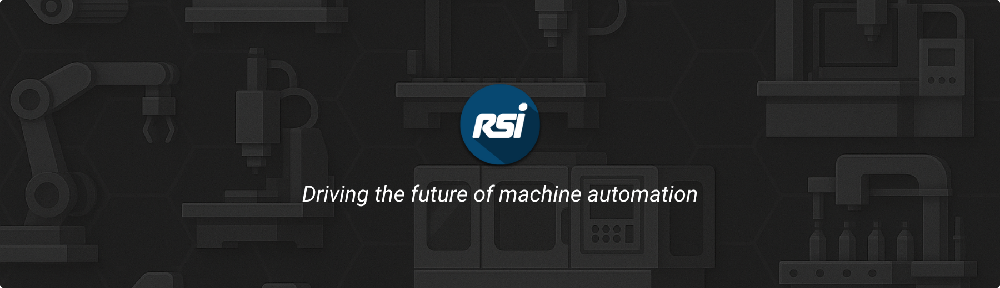
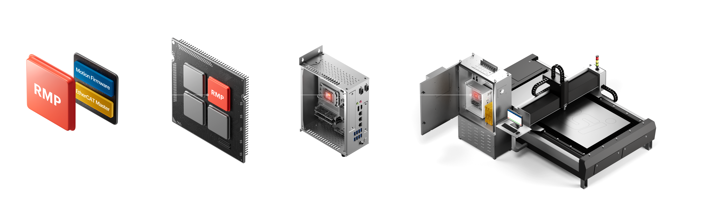

 
 

<a href="https://www.roboticsys.com/">Home</a> ·
<a href="https://www.roboticsys.com/rmp-ethercat-motion-controller">RMP</a> ·
<a href="https://support.roboticsys.com/rmp/">Docs</a> ·
<a href="https://community.roboticsys.com/">Community</a>

 

**RSI is a proven leader in PC-based motion control solutions with over 26 years of innovation and expertise.**  
We empower customers to build high-performance, cost-effective machines by providing powerful software tools and a flexible API. Our solutions are designed to maximize productivity and help manufacturers stay competitive in a global market.

 
 

## ⚡ RMP Motion Controller ⚡

[RMP](https://www.roboticsys.com/rmp-ethercat-motion-controller) is a powerful, open, and affordable PC-based EtherCAT Soft Motion Controller built for OEM machine builders. With APIs for C++, C#, Python, gRPC, and more, you can create real-time motion applications on Windows or Linux.

**Motion**  
[Point-to-Point](https://support.roboticsys.com/rmp/motion-point-to-point.html) ·
[Modify](https://support.roboticsys.com/rmp/group__rapidcode-api-samples-cs-modifymotion.html) ·
[Streaming](https://support.roboticsys.com/rmp/motion-streaming.html) ·
[Path](https://support.roboticsys.com/rmp/motion-path.html) ·
[Velocity](https://support.roboticsys.com/rmp/motion-velocity.html) ·
[Hold](https://support.roboticsys.com/rmp/motion-hold.html) ·
[Gantry](https://support.roboticsys.com/rmp/gantry.html) ·
[Camming](https://support.roboticsys.com/rmp/camming.html) ·
[Gearing](https://support.roboticsys.com/rmp/gearing.html) ·
[Capture](https://support.roboticsys.com/rmp/capture-probe.html) ·
[Phantom Axes](https://support.roboticsys.com/rmp/phantom-axes.html) ·
[Feed Rate](https://support.roboticsys.com/rmp/feed-rate.html) ·
[Multi-Axis](https://support.roboticsys.com/rmp/class_r_s_i_1_1_rapid_code_1_1_multi_axis.html) ·
[3D Interpolation](#) ·
[G-Code](https://support.roboticsys.com/rmp/gcode.html) ·
[Conveyor Tracking](#) ·
[Dual Loop Feedback](https://support.roboticsys.com/rmp/class_r_s_i_1_1_rapid_code_1_1_axis_a961a33c9f8203176d2b0bd909df56a73.html)

**IO**  
[Real-Time Triggers](https://support.roboticsys.com/rmp/user-limits.html) ·
[General Purpose IO](https://support.roboticsys.com/rmp/general-purpose-io.html) ·
[Dedicated IO](https://support.roboticsys.com/rmp/dedicated-io.html)

**Configuration**  
[Homing](https://support.roboticsys.com/rmp/homing.html) ·
[Safety (FSoE)](https://support.roboticsys.com/rmp/fsoe.html) ·
[Interrupts](https://support.roboticsys.com/rmp/sync-interrupts.html) ·
[Settling](https://support.roboticsys.com/rmp/settling.html) ·
[Backlash Compensator](https://support.roboticsys.com/rmp/backlash-compensation.html) ·
[Linear Compensator](https://support.roboticsys.com/rmp/compensator.html) ·
[3D Compensator](https://support.roboticsys.com/rmp/compensator.html) ·
[Tuning](https://support.roboticsys.com/rmp/tuning.html)

**Execution**  
[Real-Time Tasks](https://support.roboticsys.com/rmp/rttasks.html)

**Data**  
[Recording](https://support.roboticsys.com/rmp/recorder.html) ·
[Error Logging](https://support.roboticsys.com/rmp/error-logging.html)

 

### Seamless integration with 100+ EtherCAT devices

The [RMP](https://www.roboticsys.com/rmp-ethercat-motion-controller) is compatible with hardware from more than 57 manufacturers, with additional nodes added regularly.

